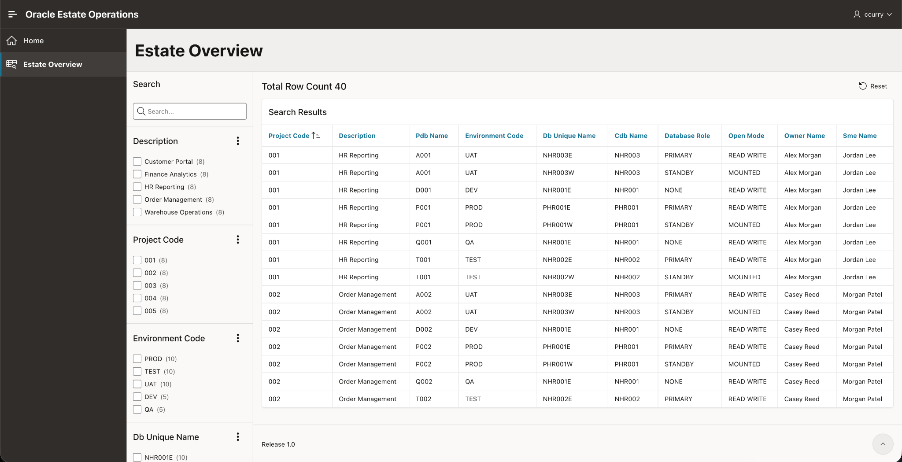
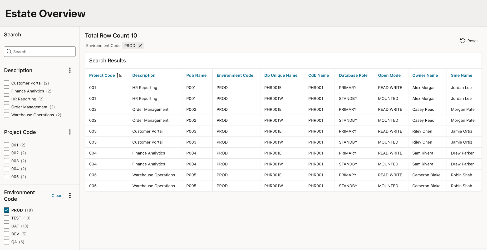

# oracle-estate-operations

Reference implementation for standardizing, automating, and operating a fictional enterprise Oracle database estate.

## Why this project exists

Large database estates become difficult to operate when every application develops its own naming, deployment, support, and exception patterns. The answer is not to make every workload identical. It is to define a supportable default, make operational state visible, automate repeatable checks, and document the places where an application has a legitimate reason to differ.

This project models that approach with a small fictional Oracle estate.

The operating pattern is simple:

> Define the standard, model the estate, expose useful state, automate repeatable work, document exceptions, and make the result supportable by someone else.

That progression matters more here than any individual tool. Oracle, SQLcl, APEX, and scripts are used because they fit the problem being modeled.

## What is implemented

The current V1 database foundation includes:

- a normalized Oracle data model for projects, environments, clusters, CDBs, RAC instances, PDBs, services, Data Guard relationships, accounts, patch schedules, and standards exceptions;
- PDB-grain operational inventory with RAC and CDB topology available as supporting detail;
- a three-schema security model separating data ownership, application-facing objects, and runtime access;
- curated operational views for estate status, topology, ownership, service placement, patch readiness, DR status, and active exceptions;
- fictional seed data with intentionally unhealthy or non-standard states so validation produces useful output instead of an unrealistically perfect estate;
- SQLcl installation and validation scripts;
- an Oracle APEX Estate Overview built as a faceted search over the curated `ESTATE_AO.V_ESTATE_STATUS` view;
- documentation for architecture, standards, security, data modeling, seed-data design, and repeatable operating procedures.

The current APEX application is intentionally small. Its purpose is to make the operational model useful to a human operator without moving the underlying rules into the UI.

## Estate Overview

The Estate Overview presents the fictional estate at PDB grain. It is backed directly by the curated `ESTATE_AO.V_ESTATE_STATUS` view, so the same database logic can be reused by other interfaces without maintaining a separate set of reporting rules in APEX.



*Estate Overview: PDB-grain operational inventory with facets for application, environment, database identity, role, ownership, and other support attributes.*

The facets let an operator narrow the same inventory to the part of the estate relevant to the question being asked. For example, filtering to production exposes application ownership and primary/standby placement while preserving the same inventory model.



*Production inventory: the same curated operational view filtered to PROD, showing application ownership and primary/standby placement without separate reporting logic in APEX.*

## Architecture at a glance

```text
                         ESTATE
                  DBA-managed data owner
                         |
              READ WITH GRANT OPTION
                         v
                      ESTATE_AO
             curated app-facing objects
                         |
                       READ
                         v
                      APPESTATE
              APEX / runtime identity
                         |
              +----------+----------+
              |                     |
         Oracle APEX           CLI / validation
```

The database layer is the system of record for the lab. APEX and command-line tooling consume the same operational views rather than recreating rules independently in each interface.

The main inventory is intentionally PDB-grain. A DBA or application owner should be able to start with a PDB and answer the common support questions without first reconstructing the RAC or CDB topology. Infrastructure detail remains available for drill-down and validation without duplicating the primary inventory rows.

See [Architecture](docs/architecture.md) and [Data Model](docs/data-model.md) for the full design.

## Why the schemas are separated

V1 uses three schemas because data ownership, application-facing database logic, and runtime access are different concerns.

- `ESTATE` owns the base data model.
- `ESTATE_AO` owns curated application-facing views and related database objects.
- `APPESTATE` is the least-privilege runtime identity used by APEX.

`APPESTATE` does not receive direct access to the `ESTATE` base tables. For read-only interfaces, the project prefers Oracle `READ` privileges over `SELECT` when locking behavior such as `SELECT ... FOR UPDATE` is not required.

This adds a little structure, but it makes the security boundary visible and testable. If an application cannot perform an action, the first question should be which privilege or ownership boundary is missing, not which broad role can be granted to make the error disappear.

See [Security Model](docs/security-model.md) for the privilege chain and validation targets.

## Standards are defaults, not dogma

The estate standard exists to remove unnecessary variation. It is not intended to override a valid application requirement.

A deviation is acceptable when it has a technical or operational reason, but the exception should be explicit, owned, reviewable, and visible to the people supporting the system. The fictional estate therefore includes documented exceptions and operational faults on purpose.

Current validation scenarios include:

- an expected-versus-observed RAC service placement mismatch;
- a deferred patch schedule;
- a Data Guard standby with lagging apply;
- an approved naming-standard exception;
- cross-project account ownership.

A completely green demo would be easier to build, but it would say less about operating a real environment.

See [Estate Standard](docs/estate-standard.md) and [Seed Data Design](docs/seed-data-design.md).

## Install and validate

The database layer is installed with SQLcl while connected as an administrative account:

```sql
@deploy/install.sql
```

The installer prompts for the three schema passwords rather than storing credentials in the repository. After installation, run:

```sql
@deploy/validate.sql
```

Validation checks both structural expectations and intentionally seeded operational states. Examples include schema privilege boundaries, inventory grain, service placement, patch readiness, Data Guard health, and active standards exceptions.

For lab prerequisites and deployment steps, start with the [Lab Deployment Runbook](docs/runbooks/lab-deployment.md).

## Repository layout

```text
deploy/
  install.sql             master SQLcl installation
  validate.sql            structural and operational validation

docs/
  architecture.md         system boundaries and design
  data-model.md           entity relationships and inventory grain
  estate-standard.md      default operating standards and exceptions
  security-model.md       schema ownership and privilege model
  seed-data-design.md     fictional topology and test scenarios
  images/                 APEX screenshots used in project documentation
  runbooks/               operator-focused deployment and procedures

sql/
  00-users/               schema creation
  10-estate/              base data model and owner grants
  20-estate_ao/           curated operational views and runtime grants
  30-seed/                fictional estate and operational scenarios
```

## Documentation approach

Documentation in this repository is treated as part of the operating model rather than a final project summary.

Top-level runbooks describe the task an operator is trying to complete. Reusable procedures are kept separate so the same steps can be called from more than one runbook without maintaining duplicate instructions. Procedures should include prerequisites, actions, validation, stop conditions, failure handling, and a clear definition of completion.

The goal is that a qualified DBA who did not design the system can understand what it is supposed to do, recognize when it is outside the standard, and know where to look next.

## V1 boundaries

This is intentionally not a simulation of a full enterprise Oracle platform. V1 does not attempt to include Terraform provisioning, Ansible configuration management, CI/CD, enterprise SSO, live OEM integration, or production-grade observability.

Those are useful technologies, but adding them only to make the repository look more complicated would work against the purpose of the project. Later additions should solve a concrete operating problem or demonstrate a clear next step in the design.

## Public-safe by design

Everything in this repository is fictional and sanitized. It contains no employer code, credentials, hostnames, application names, proprietary configuration, or copied operating procedures.
